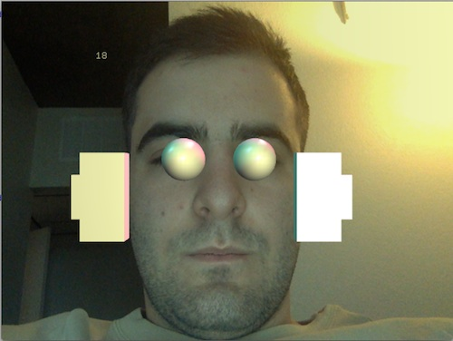
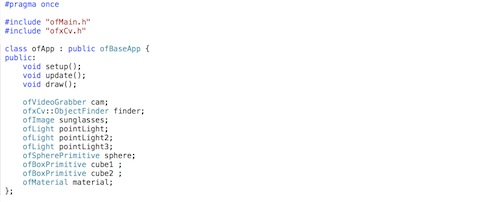
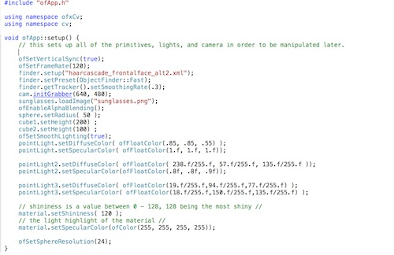
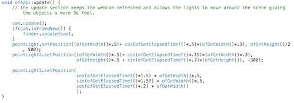
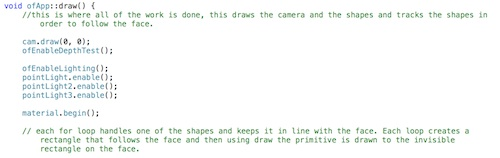
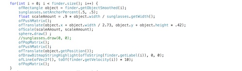

#Camera Exercise
This was an exercise to learn more about open cv as well as 3D primitives in Open Frameworks

I combined both of these elements in order to create android-like robotic eyes and ears to anyones face using the camera and 3D primitives

The code is rather simple to accomplish this loook.

Starting in app.h there is a number of variables to get started on

Next up is the app.cpp

This is where all of the work is done, first in the setup we make the webcam window, create the primitives and set up the lights and materials

Next up is update where we refresh the camera so that its a new image every frame

next is draw where ofcourse most of the work is done. we draw the camera and set up a depth test first as well as begin the material.

lastly is the several for loops within draw, each one containing the code to track and draw 1 shape. there are six for loops in total. One for each shape.

